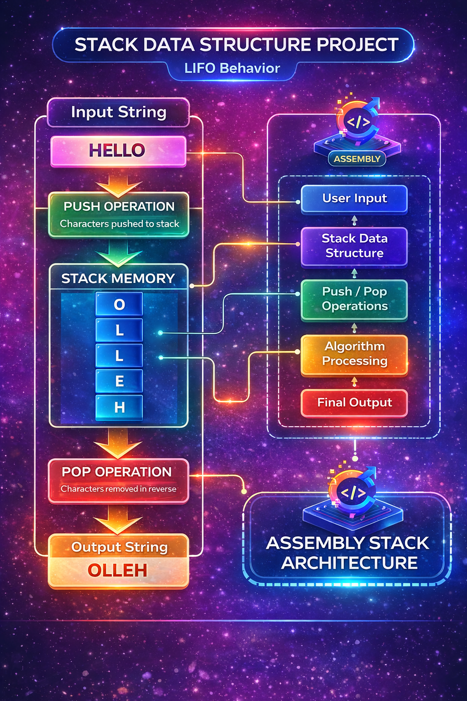

# 🧠 Assembly Stack Data Structures


## 📘 Overview

This project demonstrates how high-level data structures can be implemented using low-level assembly language programming. The focus of this project is the **Stack data structure**, which is commonly used in many programming algorithms.

Two example programs are implemented:

• String Reversal using Stack  
• Balanced Parentheses Checker using Stack

These programs show how stack operations such as **push and pop** can be implemented directly using assembly instructions.


## 📊 Stack Visualization

<p align="center">

</p>

---

## 📂 Project Structure

```
assembly-stack-data-structures
│
├── 01_String_Reversal
│   └── stack_reverse.asm
│
└── 02_Balanced_Parentheses
    └── balanced_parentheses.asm
```

## 🔁 Program 1 — String Reversal

This program demonstrates how a stack can reverse a string.

### Algorithm

1. Read each character from the input string.
2. Push characters onto the stack.
3. Pop characters from the stack.
4. Output the reversed string.

### Stack Concept

Stack follows **LIFO (Last In First Out)**.

Example:

Input:  HELLO

Stack Push:
H
E
L
L
O

Stack Pop:
O
L
L
E
H

Output: OLLEH

---

## 🧠 Program 2 — Balanced Parentheses Checker

This program checks whether parentheses are balanced using a stack.

Example expression:

((a+b)*c)

Algorithm:

1. Push `(` onto stack
2. When `)` appears → pop from stack
3. If stack becomes empty → balanced
4. If unmatched parentheses exist → not balanced

---

## ⚙️ Why Assembly Language?

Assembly provides:

• Direct hardware control  
• Efficient memory usage  
• Understanding of CPU architecture  
• Better understanding of how data structures work internally

Although high-level languages implement stacks easily, implementing them in assembly helps students understand **low-level program execution and memory management**.

---

## 👨‍💻 Author

Aniket Zaveri  
Computer Science Student

---

## 📜 License

This project is licensed under the MIT License.
